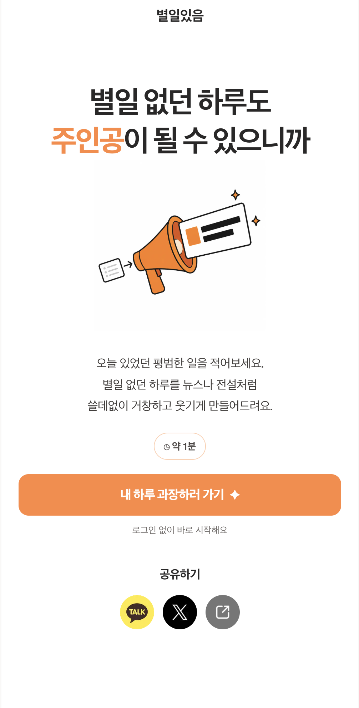
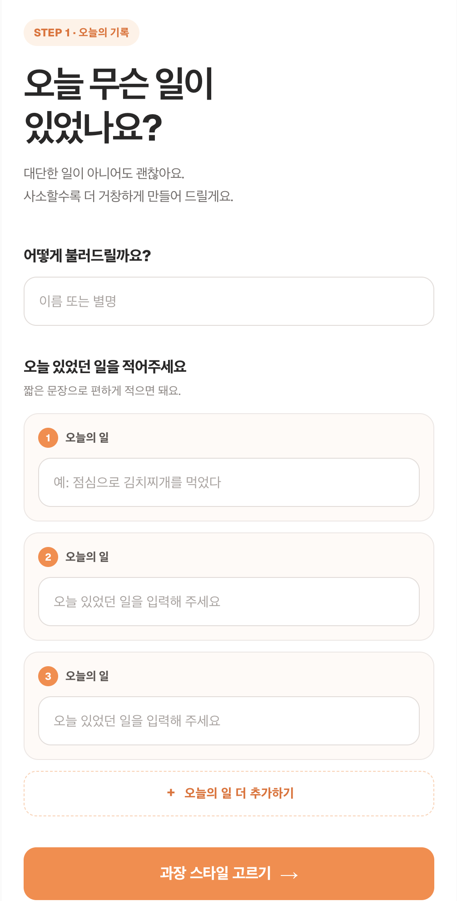
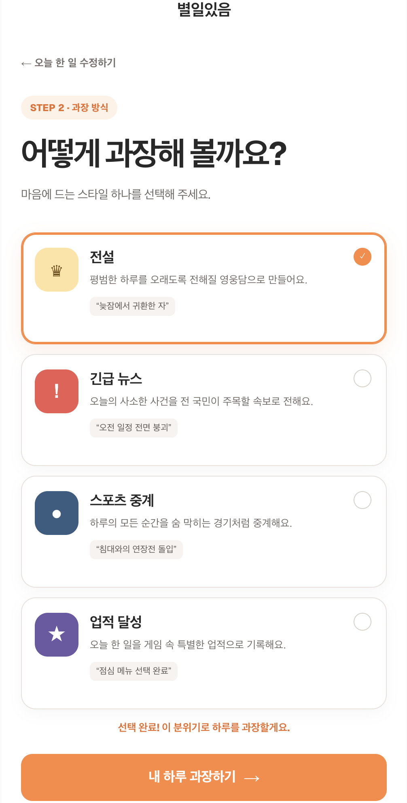
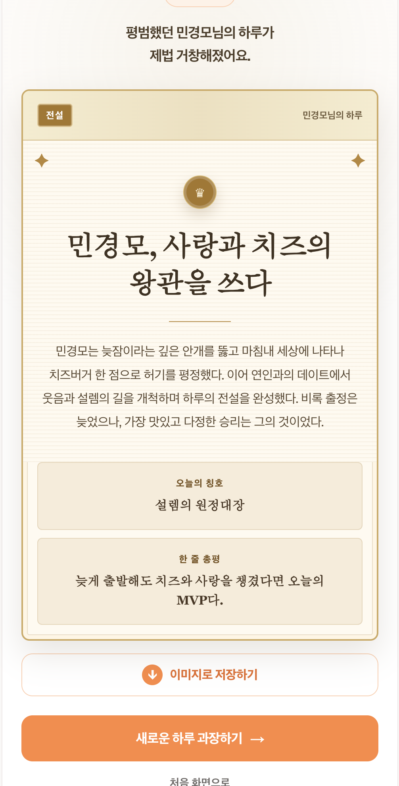

# 별일있음

> 평범한 하루를 쓸데없이 거창하고 웃기게 만들어주는 AI 과장 생성 웹서비스


[서비스 이용하기](https://byeolil.xyz)

사용자가 이름과 오늘 있었던 일을 입력하고 과장 스타일을 선택하면,
OpenAI가 전설, 긴급 뉴스, 스포츠 중계, 업적 달성 형식의 콘텐츠를 생성합니다.

생성된 결과는 이미지로 저장하거나 UUID 링크를 통해 카카오톡과 X에
공유할 수 있으며, 개인정보 보호를 위해 7일 후 자동 삭제됩니다.

## 화면 구성

| 랜딩 페이지                                         | 오늘 한 일 입력                                    |
| --------------------------------------------------- | -------------------------------------------------- |
|  |  |

| 스타일 선택                                       | 결과 페이지                                        |
| ------------------------------------------------- | -------------------------------------------------- |
|  |  |

## 주요 기능

- 이름과 오늘 있었던 일 입력 및 검증
- 네 가지 과장 스타일 선택
- OpenAI Responses API를 이용한 구조화된 결과 생성
- Neon DB 저장 및 UUID 결과 링크 제공
- 결과 카드 이미지 저장
- 카카오톡, X, 링크 복사 공유
- 생성 후 7일이 지난 결과 자동 삭제
- 모바일 중심 반응형 UI

## 주요 기술적 구현

### 구조화된 AI 결과 생성

OpenAI Responses API와 Zod 스키마를 사용해 제목, 본문, 오늘의 칭호,
한 줄 총평이 항상 정해진 형식으로 반환되도록 구성했습니다.

### 공개 결과 링크

생성 결과를 Neon DB에 저장하고 UUID 기반 `/result/[id]` 페이지를
구성했습니다. 사용자가 입력한 오늘 있었던 일의 원문은 DB에 저장하지 않습니다.

### 공유 미리보기

Next.js Metadata API를 이용해 결과별 제목과 설명을 제공하고,
카카오톡과 X에서 공통 정적 이미지를 표시하도록 구성했습니다.

### 결과 자동 삭제

Vercel Cron이 보호된 API Route를 하루 한 번 호출해 생성 후 7일이 지난
결과를 삭제하도록 구성했습니다.

## 기술 스택

| 분류         | 기술                           | 사용 목적                        |
| ------------ | ------------------------------ | -------------------------------- |
| 프레임워크   | Next.js 16 App Router          | 페이지, API Route, Metadata 구성 |
| 언어         | TypeScript                     | 정적 타입 검사                   |
| UI           | React 19, SCSS Modules         | 컴포넌트와 스타일 구성           |
| AI           | OpenAI Responses API           | 과장 결과 생성                   |
| 검증         | Zod                            | 요청값과 AI 응답 검증            |
| 데이터베이스 | Neon Postgres                  | 생성 결과와 UUID 저장            |
| 공유         | Kakao JavaScript SDK, X Intent | 결과 링크 공유                   |
| 배포         | Vercel                         | 호스팅, 방화벽, Cron 실행        |

## 프로젝트 구조

```text
src/
├── app/
│   ├── api/
│   │   ├── generate/             # AI 결과 생성 및 저장 API
│   │   └── cron/                 # 만료된 결과 자동 삭제 API
│   ├── create/                   # 오늘 한 일 입력 및 스타일 선택
│   ├── result/
│   │   └── [id]/                 # UUID 기반 결과 페이지
│   ├── privacy/                  # 개인정보처리방침
│   ├── terms/                    # 이용약관
│   └── _components/              # 공통 UI 컴포넌트
├── lib/
│   ├── db.ts                     # Neon DB 연결
│   ├── sharedResults.ts          # 결과 저장, 조회 및 삭제
│   └── generatePrompt.ts         # OpenAI 프롬프트 구성
├── schema/
│   └── generate.ts               # 요청 및 AI 결과 Zod 스키마
├── mocks/
│   └── generatedResults.ts       # 개발용 Mock 결과
└── types/                        # 외부 SDK 타입 선언
```

## 환경변수

프로젝트 실행에는 다음 환경변수가 필요합니다.

```env
OPENAI_API_KEY=
DATABASE_URL=
USE_MOCK_RESULTS=
NEXT_PUBLIC_KAKAO_JAVASCRIPT_KEY=
SITE_URL=
CRON_SECRET=
```
